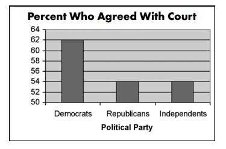

## Getting started

To work with R Markdown: 

* Install [R](http://www.r-project.org/)
* Install the lastest version of [RStudio](http://rstudio.org/download/)
* Install the latest version of the `knitr` package: `install.packages("knitr")`

To knit a PDF file, you need to install TeX. 

* Easy way is to install the `tinytex` package by running the following lines: 

```{r, eval=FALSE}
install.packages("tinytex")
tinytex::install_tinytex()
```

* If you want full version of TeX: For Mac install [MacTeX](http://www.tug.org/mactex/downloading.html). For Windows install [TeX Live](http://tug.org/texlive/acquire-netinstall.html).

* More info: 
  * [R Markdown Reference Guide](https://rstudio.com/wp-content/uploads/2015/03/rmarkdown-reference.pdf)
  * [R Markdown Cheat Sheet](https://rstudio.com/wp-content/uploads/2015/02/rmarkdown-cheatsheet.pdf)

\newpage

## Prepare for analyses
```{r, warning=FALSE, message=FALSE}
set.seed(1234)

#install.packages("tidyverse")
#install.packages("stargazer")
#install.packages("pander")

library(tidyverse)
library(stargazer)
library(pander)
```

Without specify the options of chunk, you could get *warning* or package messages. 

## Basic console output

To insert an R code chunk, you can type or insert it manually. You can also use the shortcut key (Windows: Ctrl + Alt + I; OS X: Cmd + Option + I). This will produce the following code chunk:

    ```{r}
    
    ```


You can label a code chunk with a name (no space). Pressing tab when inside the braces will show code chunk options.

The following R code chunk is labelled `basic-df` and will be displayed as follow: 

```{r, basic-df, echo=TRUE}
x <- 1:10
y <- round(rnorm(10, x, 1), 2)
df <- data.frame(x, y)
df
```

\newpage

## R Code chunk features

Frequently used chunk options: 

Option  |   Description
- | -----
include  |  If FALSE, knitr will run the code but prevent the code chunk AND results from appearing
echo     |  If FALSE, knitr will run the code, show the results but prevent the code chunk from appearing (useful for embedding figures or tables).
error    |  If FALSE, knitr will not display any error messages generated by the code.
message  |  If FALSE, knitr will not display any messages generated by the code.
warning  |  If FALSE, knitr will not display any warning messages generated by the code.

### Echo and Results

The following code hides the command input (i.e., `echo=FALSE`) but displays the table output.

```{r, basic-df2, echo=FALSE}
x <- 1:10
y <- round(rnorm(10, x, 1), 2)
df <- data.frame(x, y)
df
```

You can also display a r object with *backtick* r object-name *backtick* : The first element of y is `r y[1]`.  

### Message and Warning 

A code chunk without any specification of options show all warnings and messages which might be unnecessary for readers:

```{r}
df %>% 
  summarize_at(vars(y), funs(mean))
```

This code does not output warnings:

```{r, warning=FALSE}
df %>% 
  summarize_at(vars(y), funs(mean))
```

## Basic markdown functionality

### List items
Simple dot points:

* Point 1
* Point 2
* Point 3

and numeric dot points:

1. Number 1
2. Number 2
3. Number 3

and nested dot points:

* A
    * A.1
    * A.2
* B
    * B.1
    * B.2

### Tables

Manual tables can be included using the following notation:

A  | B | C
--- | --- | ---
1  | Male | Purple
2  | Female | Gold
3 | Non-binary | White

For displaying `data.frame` as table, you can create prettier output by using `pander` or `kable` functions.

With `pander`: 

```{r, echo = FALSE}
df %>% 
  pander(caption = "Fancy table from pander")
```

With `kable`: 

```{r, echo = FALSE}
df %>% 
  knitr::kable(caption = "Fancy table from kable") 
```

For regression tables, the default output is not very pretty:  

```{r}
mod1 <- y ~ x 
res1 <- lm(formula = mod1, data = df)

mod2 <- y ~ x^2  
res2 <- lm(formula = mod2, data = df)

summary(res1)
summary(res2)
```

Use `stargazer` package to display format regression tables: 

```{r, results='asis', echo = FALSE}
stargazer(res1, res2, type = "latex", header = FALSE)

#For html
#stargazer(res1, res2, type = "html")
```

More info:
[Cheat Sheet](https://www.jakeruss.com/cheatsheets/stargazer/)

\newpage 

### Plots

You can also display plots from `ggplot2` or other graphic packages

```{r, echo=FALSE, message=FALSE}
df %>% 
  ggplot(aes(x = x, y = y))+
  geom_point()+
  geom_smooth(method = "lm")+
  labs(title = "Sample Plot",
       y = "Happiness",
       x = "Exam score")+
  theme_bw()
```


### Images

Images can be embedded using `knitr::include_graphics()`:

```{r, echo=FALSE, out.width='65%', fig.align='center'}

```

Source: Statistics How To "\href{https://www.statisticshowto.com/misleading-graphs/}{Misleading Graphs: Real Life Examples}" 

### Equations

Equations are included by using LaTeX notation and including them either between single dollar signs (inline equations) or double dollar signs (displayed equations).
If you hang around the Q&A site [CrossValidated](http://stats.stackexchange.com) you'll be familiar with this idea.

There are inline equations such as $y_i = \alpha + \beta x_i + e_i$.

And displayed formulas:

$$\frac{1}{1+\exp(-x)}$$

$$
x = \frac{-b \pm \sqrt{b^2 - 4ac}}{2a}
$$

$$
\begin{split}
X & = (x+a)(x-b) \\
  & = x(x-b) + a(x-b) \\
  & = x^2 + x(a-b) - ab
\end{split}
$$

More info:
[LaTeX wiki](https://en.wikibooks.org/wiki/LaTeX/Mathematics)


